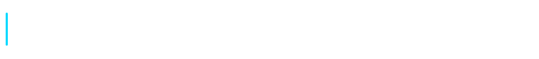
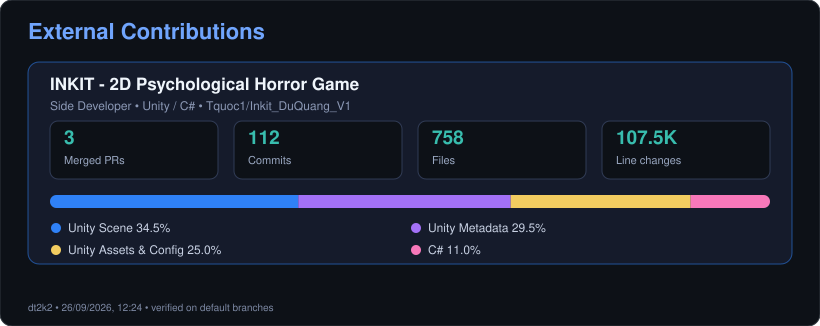

  

  <strong>Backend Developer | Unity Developer | Security Enthusiast</strong>

I'm passionate about building web applications, backend systems, games, and exploring web security.

---

## 🚀 About Me

- 💻 Learning Backend Development
- 🎮 Developing Unity WebGL Games
- 🏆 Building Leaderboard & Ranking Systems
- 🔐 Interested in Authentication, Networking & Web Security
- 🌱 Currently learning Spring Boot, Node.js & Cybersecurity Tools

---

## 🛠️ Tech Stack

  

  
  
  
  
  
  

---

## 🏅 Certifications

<table>
  <tr>
    <td align="center" width="50%">
      
       <strong>CCNA: Introduction to Networks</strong>
       Issued by Cisco Networking Academy
       <a href="https://www.credly.com/users/bui-thang">View on Credly</a>
    </td>
    <td align="center" width="50%">
      
       <strong>CCNA: Switching, Routing, and Wireless Essentials</strong>
       Issued by Cisco Networking Academy
       <a href="https://www.credly.com/users/bui-thang">View on Credly</a>
    </td>
  </tr>
  <tr>
    <td align="center" width="50%">
      
       <strong>CyberOps Associate</strong>
       Issued by Cisco Networking Academy
       <a href="https://www.credly.com/users/bui-thang">View on Credly</a>
    </td>
    <td align="center" width="50%">
      
       <strong>Ethical Hacker</strong>
       Issued by Cisco Networking Academy
       <a href="https://www.credly.com/users/bui-thang">View on Credly</a>
    </td>
  </tr>
</table>

  <a href="https://www.credly.com/users/bui-thang">View all verified credentials on Credly →</a>

## 📌 Featured Projects

### 🎮 Economic Simulation Game

A Unity WebGL game about economics with online ranking.

### 🏆 Ranking API

REST API for score submission and leaderboard.

### 🔐 Security Lab

Practice projects for:

- Session
- Cookies
- JWT
- CSRF
- XSS

---

## 📊 GitHub Activity & Contributions

  
  

> These cards are generated inside this repository and updated automatically every day.

### External Contributions

  

> External contribution statistics include only merged pull requests and commits attributed to `dt2k2` on each repository's default branch. File types are calculated from the files actually changed by those commits.

## 🚀 Repositories

### 🎮 Game Development

- **[Dư Quang (Inkit DuQuang V1)](https://github.com/Tquoc1/Inkit_DuQuang_V1)** — A 2D psychological-horror adventure built with Unity and C#, featuring exploration, branching dialogue, puzzles, limited resources, and bilingual support. I contribute to this team repository.
- **[Kaspital Simulator](https://github.com/dt2k2/Kaspital-Simulator)** — A Unity-based economic simulation project for experimenting with gameplay systems and decision-driven mechanics.
- **[Logic Choice](https://github.com/dt2k2/LogicChoice)** — A compact choice-driven project focused on interaction flow, branching decisions, and gameplay logic.

### 🌐 Interactive Learning

- **[History Game Learning](https://github.com/dt2k2/HistoryGameLearning)** — An interactive history-learning web experience built with TanStack Start, React, Tailwind CSS, Zustand, and Motion, combining a cinematic lesson with a decision-based simulation.

---

## 📫 Contact

- Email: ducthang151102@gmail.com

<!--
**dt2k2/dt2k2** is a ✨ _special_ ✨ repository because its `README.md` (this file) appears on your GitHub profile.

Here are some ideas to get you started:

- 🔭 I’m currently working on ...
- 🌱 I’m currently learning ...
- 👯 I’m looking to collaborate on ...
- 🤔 I’m looking for help with ...
- 💬 Ask me about ...
- 📫 How to reach me: ...
- 😄 Pronouns: ...
- ⚡ Fun fact: ...
-->
